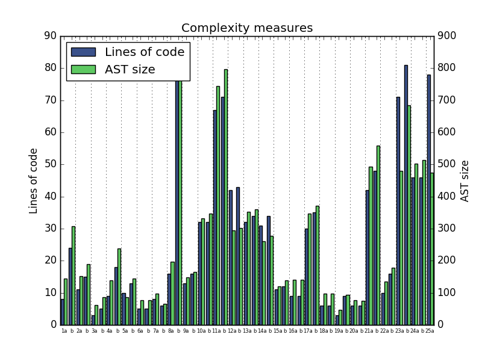

# Advent of Code 2016

This repository contains my solutions for Advent of Code 2016. Although I sometimes have time to polish solutions, I expect many solutions will be quick and dirty. Even so, there are a couple of goals that I have set myself, which are listed below.

Parts of this document were generated using `make_readme.py`.

## Python

Goal: write the solutions only using Python. So far, I am reaching this goal!

## Length

Goal: write short solutions. Although hard to quantify, I created the below graph to try to illustrate the length of my solutions. The 'Lines of code' metric shows the non-whitespace, non-comment lines of each solution. The 'AST size' metric shows the size of the abstract syntax tree as provided by the `ast` module.

The correlation between the two measures is 0.95. The average increase in lines of code between parts _a_ and _b_ of a puzzle is 42%. The average increase in AST size between parts _a_ and _b_ of a puzzle is 30%. 

## Imports

Goal: use as few imports as possible/wise, and preferably only from the standard library. The below table shows the modules imported for each puzzle's solution. The 'Standard' column includes all modules from the standard library.

| Part | None (6) | Standard (38) | `numpy` (10) | `intervaltree` (1) | `PIL` (1) | `cv2` (1) | `tesserocr` (1) | `matplotlib` (1) | `scipy` (1) |
| :---: | :---: | :---: | :---: | :---: | :---: | :---: | :---: | :---: | :---: |
| 1a (0) | :heavy_check_mark: |  |  |  |  |  |  |  |  |
| 1b (1) |  | :heavy_check_mark: |  |  |  |  |  |  |  |
| 2a (0) | :heavy_check_mark: |  |  |  |  |  |  |  |  |
| 2b (0) | :heavy_check_mark: |  |  |  |  |  |  |  |  |
| 3a (0) | :heavy_check_mark: |  |  |  |  |  |  |  |  |
| 3b (1) |  |  | :heavy_check_mark: |  |  |  |  |  |  |
| 4a (2) |  | :heavy_check_mark: |  |  |  |  |  |  |  |
| 4b (4) |  | :heavy_check_mark: |  |  |  |  |  |  |  |
| 5a (2) |  | :heavy_check_mark: |  |  |  |  |  |  |  |
| 5b (2) |  | :heavy_check_mark: |  |  |  |  |  |  |  |
| 6a (1) |  | :heavy_check_mark: |  |  |  |  |  |  |  |
| 6b (1) |  | :heavy_check_mark: |  |  |  |  |  |  |  |
| 7a (1) |  | :heavy_check_mark: |  |  |  |  |  |  |  |
| 7b (1) |  | :heavy_check_mark: |  |  |  |  |  |  |  |
| 8a (2) |  | :heavy_check_mark: | :heavy_check_mark: |  |  |  |  |  |  |
| 8b (8) |  | :heavy_check_mark: | :heavy_check_mark: |  | :heavy_check_mark: | :heavy_check_mark: | :heavy_check_mark: |  | :heavy_check_mark: |
| 9a (1) |  | :heavy_check_mark: |  |  |  |  |  |  |  |
| 9b (1) |  | :heavy_check_mark: |  |  |  |  |  |  |  |
| 10a (2) |  | :heavy_check_mark: |  |  |  |  |  |  |  |
| 10b (2) |  | :heavy_check_mark: |  |  |  |  |  |  |  |
| 11a (5) |  | :heavy_check_mark: |  |  |  |  |  |  |  |
| 11b (5) |  | :heavy_check_mark: |  |  |  |  |  |  |  |
| 12a (2) |  | :heavy_check_mark: |  |  |  |  |  |  |  |
| 12b (2) |  | :heavy_check_mark: |  |  |  |  |  |  |  |
| 13a (1) |  | :heavy_check_mark: |  |  |  |  |  |  |  |
| 13b (1) |  | :heavy_check_mark: |  |  |  |  |  |  |  |
| 14a (2) |  | :heavy_check_mark: |  |  |  |  |  |  |  |
| 14b (2) |  | :heavy_check_mark: |  |  |  |  |  |  |  |
| 15a (2) |  | :heavy_check_mark: |  |  |  |  |  |  |  |
| 15b (2) |  | :heavy_check_mark: |  |  |  |  |  |  |  |
| 16a (1) |  |  | :heavy_check_mark: |  |  |  |  |  |  |
| 16b (1) |  |  | :heavy_check_mark: |  |  |  |  |  |  |
| 17a (2) |  | :heavy_check_mark: |  |  |  |  |  |  |  |
| 17b (2) |  | :heavy_check_mark: |  |  |  |  |  |  |  |
| 18a (0) | :heavy_check_mark: |  |  |  |  |  |  |  |  |
| 18b (0) | :heavy_check_mark: |  |  |  |  |  |  |  |  |
| 19a (1) |  | :heavy_check_mark: |  |  |  |  |  |  |  |
| 19b (1) |  | :heavy_check_mark: |  |  |  |  |  |  |  |
| 20a (1) |  |  | :heavy_check_mark: |  |  |  |  |  |  |
| 20b (1) |  |  | :heavy_check_mark: |  |  |  |  |  |  |
| 21a (2) |  | :heavy_check_mark: | :heavy_check_mark: |  |  |  |  |  |  |
| 21b (2) |  | :heavy_check_mark: | :heavy_check_mark: |  |  |  |  |  |  |
| 22a (3) |  | :heavy_check_mark: |  | :heavy_check_mark: |  |  |  |  |  |
| 22b (4) |  | :heavy_check_mark: | :heavy_check_mark: |  |  |  |  | :heavy_check_mark: |  |
| 23a (2) |  | :heavy_check_mark: |  |  |  |  |  |  |  |
| 23b (2) |  | :heavy_check_mark: |  |  |  |  |  |  |  |
| 24a (3) |  | :heavy_check_mark: |  |  |  |  |  |  |  |
| 24b (3) |  | :heavy_check_mark: |  |  |  |  |  |  |  |
| 25a (2) |  | :heavy_check_mark: |  |  |  |  |  |  |  |

## Full and exact answer

Goal: have the script display the full and exact answer to the puzzle, with no human interpretation necessary. I may force myself not to submit an answer to AoC, even if I know it, until Python can know it too. For example, puzzle 8b is difficult in this regard, as it requires reading text from an image. The below table shows my progress in this regard.

| Part | Unsolved | Requires human | Totally automated |
| :---: | :---: | :---: | :---: |
| 8b |  | :heavy_check_mark: [1](#footnote1) |  |
| 11a |  | :heavy_check_mark: [2](#footnote2) |  |
| 11b |  | :heavy_check_mark: [2](#footnote2) |  |
| 22b |  | :heavy_check_mark: [1](#footnote1) |  |
| rest |  |  | :heavy_check_mark: |

<a name="footnote1">1</a>: Requires human to read the answer text from a pixel array.

<a name="footnote2">2</a>: Answer is precise and complete, but only correct some of the time. So a human is required to retry submission multiple times.
